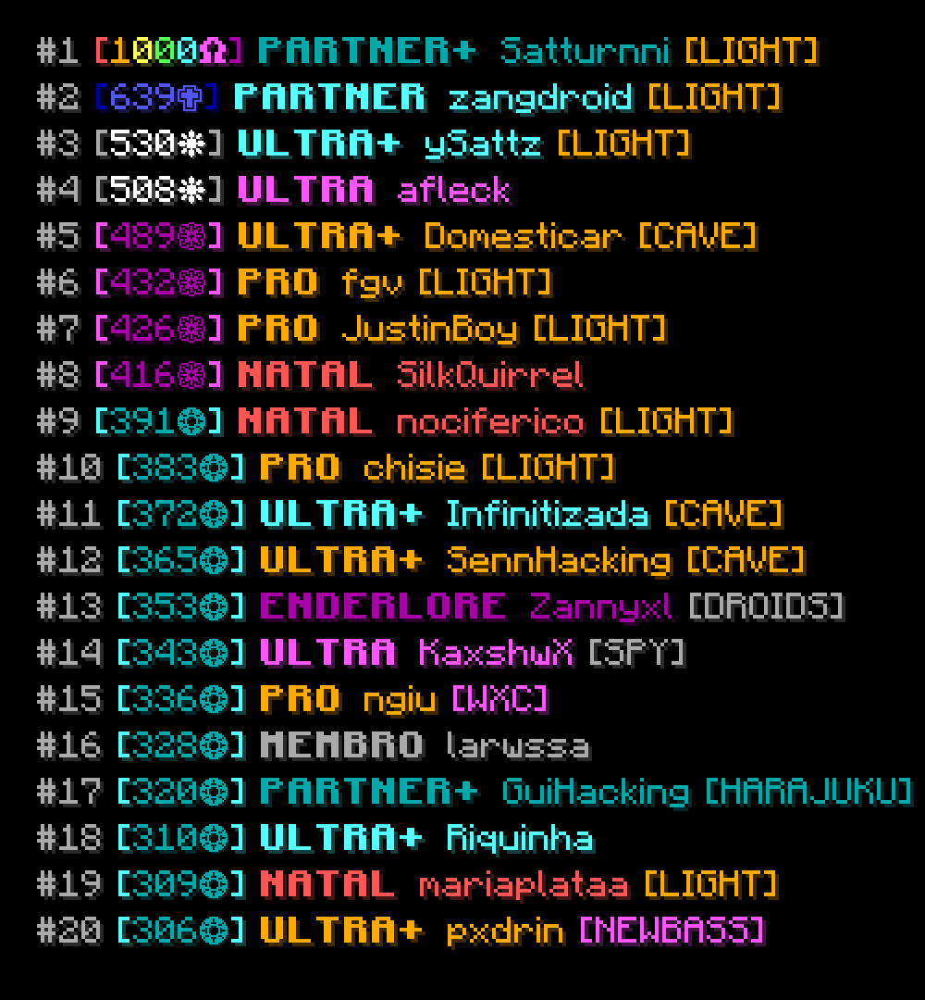

# Minecraft Font Renderer

Minecraft-style text renderer for Node.js using `skia-canvas`.

It supports Minecraft color codes, shadows, bold, italic, Unicode glyphs, HD ASCII font textures, and cached glyph rendering.

## Features

- Minecraft color codes: `&a`, `&c`, `§d`
- Formatting codes: bold `&l`, italic `&o`, reset `&r`
- Automatic Minecraft-style shadow colors
- ASCII and Unicode font textures
- Optional HD ASCII font with `ascii_hd.png`
- Cached glyph rendering
- Built for `skia-canvas`

## Installation

```console
npm install minecraft-font-renderer
```

## Basic Usage

```ts
import { Canvas } from "skia-canvas";
import { writeFile } from "node:fs/promises";
import { FontRender, defaultFontPath } from "minecraft-font-renderer";

const renderer = new FontRender();

await renderer.loadImages(defaultFontPath);

const canvas = new Canvas(560, 250);
const ctx = canvas.getContext("2d");

ctx.imageSmoothingEnabled = false;
ctx.fillStyle = "#000000";
ctx.fillRect(0, 0, canvas.width, canvas.height);

const text = "&bHello World!";

await renderer.fillText(ctx, text, 50, 80, {
  shadow: true,
  size: 8,
  hdFont: false,
});

const buffer = await canvas.toBuffer("png");
await writeFile("./basic.png", buffer);
```

## Run the Example

Run the local example after cloning this repository:

```console
npm install
npx tsx examples/basic.ts
```

## Formatting Codes

Both `&` and `§` prefixes are supported.

| Code | Description |
| --- | --- |
| `&0` - `&f` | Minecraft colors |
| `&l` | Bold |
| `&o` | Italic |
| `&r` | Reset formatting |

Example:

```ts
import { parseMinecraftText } from "minecraft-font-renderer";

parseMinecraftText("&d&lHello &cWorld&a!");
parseMinecraftText("§d§lHello §cWorld§a!");
```

When using `renderer.fillText(...)`, parsing is handled automatically.

## HD Font

The included font assets provide `ascii_hd.png`. Enable HD ASCII glyphs with:

```ts
await renderer.fillText(ctx, "&bHello World!", 50, 80, {
  shadow: true,
  size: 8,
  hdFont: true,
});
```

`hdFont: true` uses `ascii_hd.png` for ASCII characters.

## Font Assets

Before rendering, load the included font textures:

```ts
import { FontRender, defaultFontPath } from "minecraft-font-renderer";

const renderer = new FontRender();

await renderer.loadImages(defaultFontPath);
```

The included assets contain:

```txt
ascii.png
ascii_hd.png
unicode_page_00.png
unicode_page_01.png
...
```

## Font Metrics

Glyph metrics are generated from the font textures by scanning visible pixels in each glyph cell.

If you change the font assets, regenerate the metrics with:

```console
npm run gen:metrics
```

## Leaderboard Example

This repository also includes a Mush leaderboard example that fetches public leaderboard data and renders it as an image.

```console
npx tsx examples/mushLeaderboard.ts
```

The Mush example is only a usage demo. The renderer itself does not depend on the Mush API.

## Performance

Glyphs are cached after first use. The renderer stores the visible pixels for each glyph, so repeated characters can be drawn without reading the font texture again.

This helps when rendering repeated text, leaderboards, and stat cards.

## Preview

### Normal Font


### HD Font


### Leaderboard Example



## Disclaimer

Minecraft is a trademark of Mojang Studios/Microsoft. This project is not affiliated with or endorsed by Mojang Studios or Microsoft.

## License
This project is licensed under the ISC License.